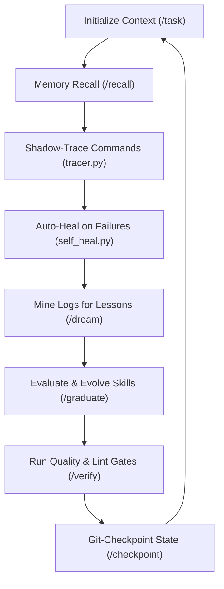

# 🧠 AgentOS — The Portable Memory, Security & Self-Healing Layer for AI Agents

[](LICENSE)
[](https://www.python.org)
[](https://github.com)

**Stop building stateless agents.** Turn Cursor, Claude Desktop, and custom agent scripts into production-grade developers. **AgentOS** (powered by UALL) is a lightweight, zero-dependency engine you can drop into any repository to instantly equip your AI developer with long-term memory, execution guardrails, and self-healing loops.

```
                  ┌────────────────────────────────────────┐
                  │          AI AGENT (Cursor/Claude)      │
                  └──────────────────┬─────────────────────┘
                                     │ (MCP / CLI)
                  ┌──────────────────▼─────────────────────┐
                  │                AgentOS                 │
                  └──────┬───────────┬──────────────┬──────┘
                         │           │              │
           ┌─────────────▼─────┐┌────▼────────┐┌────▼─────────────┐
           │   HYBRID MEMORY   ││ GOVERNANCE  ││   SELF-HEALING   │
           │ SQLite FTS5 + Graph││ Policy Gate ││ Log Correlation │
           └───────────────────┘└─────────────┘└──────────────────┘
```

---

## ⚡ The Value Proposition

| Feature | Standard AI Agent | AgentOS-Empowered Agent |
| :--- | :--- | :--- |
| **Context Retention** | Single-session, forgets past file paths & fixes | Hybrid FTS5 + Entity Relationship Knowledge Graph |
| **Execution Safety** | Runs arbitrary commands blindly (dangerous) | Pre-command gatekeeper matching your security policy |
| **Continuous Learning**| Repeats identical errors and loops infinitely | Failure correlation mining + active self-healing hints |
| **State Tracking** | Manual git commits (or none) | Auto-verified Git checkpoints after successful quality gates |

---

## 🛠️ The Agentic Loop

AgentOS organizes the agent's behavior into a structured, continuous reinforcement loop:



---

## 🚀 Quick Start (5 Seconds)

Add AgentOS to any project instantly:

### 1. Bootstrap the Engine
Run the bootstrap script inside your target project root:
```bash
python uall_bootstrap.py
```
This initializes the `.agent/` directory structure, detects your project type, and sets up your local configurations.

### 2. Check Agent Status
Check the status of the local AgentOS brain:
```bash
python uall.py /status
```

### 3. Connect to your IDE (MCP Setup)
AgentOS exposes a local Model Context Protocol (MCP) server so Cursor, Claude Desktop, or VSCode can access its tools natively. 

Add this to your IDE's MCP settings:
```json
{
  "mcpServers": {
    "agent-os": {
      "command": "python",
      "args": [".agent/tools/mcp_server.py"],
      "cwd": "."
    }
  }
}
```
*(For detailed setup and configurations, see [MCP_SETUP.md](file:///C:/Users/Johnny%20Cage/Projects/UALL-Antigravity/MCP_SETUP.md))*

---

## 📦 Architecture & Directory Layout

AgentOS operates entirely locally within a portable `.agent/` directory:

```
.agent/
├── GOVERNANCE.md          # Security policy, risk tiers, & capability grants
├── PLAYBOOK.md            # Auto-generated knowledge-base from graduated lessons
├── AGENTS.md              # Role definitions & standard operating procedures
├── memory/
│   ├── episodic/          # Per-day JSONL event logs captured during commands
│   ├── candidate_lessons/ # Proposed learnings awaiting graduation
│   ├── graduated/         # LESSONS.md + LESSONS.jsonl (the source of truth)
│   ├── graph/             # entities.md + relationships.jsonl knowledge graph
│   └── .index/            # SQLite FTS5 search index database
├── skills/
│   ├── core/              # Built-in system instructions
│   ├── domain/            # Graduated project-specific skills
│   └── pending/           # Staged skills awaiting human review
├── protocols/
│   ├── semgrep_rules.yaml # Static security & structural checks
│   ├── hook_patterns.json # Event-driven pre/post tool hooks
│   └── self_healing_hints.md # Dynamic hints built from command failures
└── tools/                 # Python engine scripts (verify, recall, self_heal, etc.)
```

---

## 💎 Key Features

### 🧠 1. Hybrid Semantic & Graph Memory
Standard search is not enough. AgentOS combines **SQLite FTS5 full-text indexing** with an **Entity-Relationship Knowledge Graph** to trace code dependencies, previous refactorings, and file mappings.
* `/recall <query>` queries both lexical indices and code relationships to construct a hyper-relevant context.

### 🛡️ 2. Pre-Command Governance
Protect your environment. When your agent attempts to execute a terminal command (e.g., `git`, `docker`, `rm`), the AgentOS pre-tool hook interceptor validates the command against [.agent/GOVERNANCE.md](file:///C:/Users/Johnny%20Cage/Projects/UALL-Antigravity/.agent/GOVERNANCE.md).
* Auto-approves safe commands (Tier 1).
* Prompts or logs medium-risk activities (Tier 2).
* Blocks high-risk or unauthorized commands (Tier 3) until approved.

### 🩹 3. Self-Healing Failures
When a task fails, `tracer.py` captures the traceback and exit code. `self_heal.py` correlates recurring failures to write active hints in [protocols/self_healing_hints.md](file:///C:/Users/Johnny%20Cage/Projects/UALL-Antigravity/.agent/protocols/self_healing_hints.md), which are automatically injected into the agent's context next time it attempts a similar command.

### 💾 4. Verified Checkpoint & Recovery
Never let an agent break your code.
* `/verify` runs Semgrep rules, Ruff checks, and pytest suites.
* On success, it unlocks `/checkpoint "<msg>"` which creates a Git-signed snapshot of the code and agent memory.
* If the agent goes off the rails, `/recover` instantly rolls back the codebase and brain state to the last verified checkpoint.

---

> [!IMPORTANT]
> **AgentOS** is completely open-source, local-first, and contains no external API dependencies. All memory, database indices, and event logs are stored directly in your codebase's `.agent/` folder.

---

## 🌟 Support & Contributions

Give us a star ⭐ if this project helps you build better agents! Contributions, bug reports, and suggestions are welcome.
